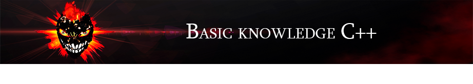

✨Dvurechensky✨

    

        
    
    

        
    

    

        
        
    

# Разбор языка программирования C++ 🚏

- 🚩 Комментирование кода, пространства имён, выбор поддерживаемого языка вывода, ввод данных
- 🚩 Escape-последовательности
- 🚩 Типы данных
- 🚩 Переменные, константы 
- 🚩 Арифметические операции, ввод данных

> [!IMPORTANT]
> P.s Ещё в разработке!

✨Dvurechensky✨
